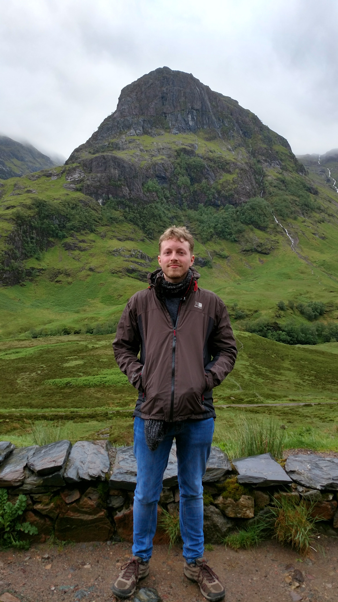

<link rel="stylesheet" href="./index/about.css" type="text/css">

I am French expatriate leaving in Manchester, in the United Kingdom.

Since very little my parents used to take me and my sisters for a hike on most weekends, among the beautiful forests and mountains of the Jura, my native region in France, and I have continued to hike regularly everywhere I went since then. When I arrived in UK several years ago I intended for sure to continue this practice but I have only started exploring the region recently. 

I realised quickly that without using a car it is rather hard around Manchester to find hiking areas reachable by public transport, even with the help of books or local websites. Not having a car, and not wishing to use one, I have invested a lot of efforts in the past few months to find walks and hikes I could reach by relying only on public transports, and even though it is a rewarding task, it can also be a very frustrating one.

I created this blog to make it easier for other carless hikers to find ways to explore the North-west of England without the hassle of having to scour books and websites like I had to. I hope it will be useful to you. 